# Анализ сайта lifehacker.ru

Профили, использованные при анализе лежат в папке profiles:

* [network.har](profiles/lifehacker-network)
* [performance.json](profiles/lifehacker-performance.json)
* [performance-slowdown.json](profiles/lifehacker-performance-slowdown.json)
* [coverage.json](profiles/lifehacker-coverage.json)

## Network

### Проблема №1. Блокирующие запросы

Для определения блокирующих запросов, я использовал команду ```Show Request Blocking``` в Chrome DevTools. Картина следующая:

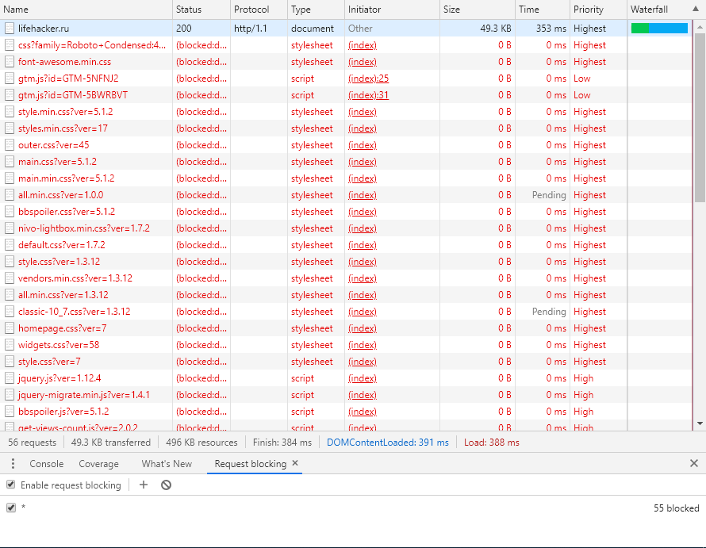

Всего **55** блокирующих загрузку запросов. Если мы посмотрим на `index.html`, то увидим, что загружается множество css и js файлов (бесполезных, но об этом позже) в теге `<head>`.

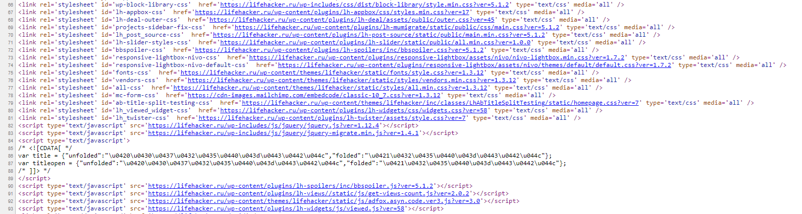

Анализ от GTMetrix показывает, что можно сэкономить порядка **639KB** только на JavaScript коде. 

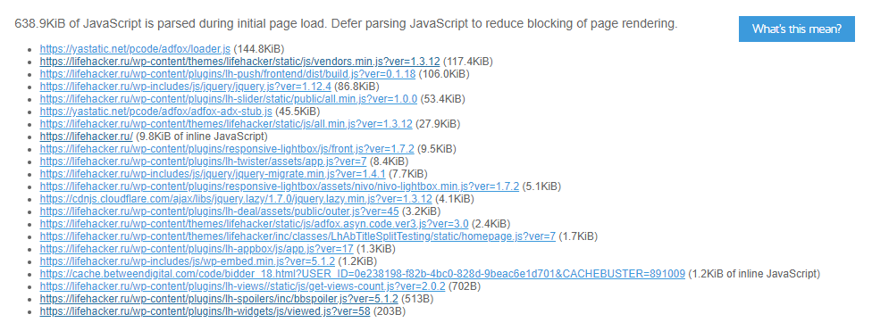

Если посмотреть на блокирующие CSS файлы, то увидим, что некоторые из них очень маленькие:

* https://lifehacker.ru/wp-content/plugins/lh-deal/assets/public/outer.css
* https://lifehacker.ru/wp-content/plugins/lh-mumigrate/static/public/css/main.css
* https://lifehacker.ru/wp-content/plugins/lh-post-source/static/public/main.min.css
* https://lifehacker.ru/wp-content/plugins/lh-twister/assets/style.css
* https://lifehacker.ru/wp-content/themes/lifehacker/inc/classes/LhAbTitleSplitTesting/static/homepage.css

Встречаются также и маленькие JS файлы:

* https://lifehacker.ru/wp-content/plugins/lh-spoilers/inc/bbspoiler.js
* https://lifehacker.ru/wp-content/plugins/lh-widgets/js/viewed.js

**Решение:**  

Объеденить все маленькие JS и CSS файлы в один и грузить одним запросом, если нужно. Все ненужные JS и CSS удалить из `<head>`. JavaScript можно перенести к закрывающему тегу `<body>` и подгружать с помощью `defer` или `async`. Так как сайт работает на WordPress, можно всё автоматизировать с помощью [специальных плагинов](https://wordpress.org/plugins/search/defer+css+javascript/).

### Проблема №2. Лишний размер ресурса

На сайте встречаются неминифицированные скрипты и стили, например:

* https://lifehacker.ru/wp-content/themes/lifehacker/static/js/vendors.min.js
* https://lifehacker.ru/wp-content/plugins/responsive-lightbox/js/front.js
* https://lifehacker.ru/wp-content/plugins/lh-widgets/css/widgets.css

В целом можно сэкономить примерно `15KB`.

`index.html` содержит около 8300 строчек кода, можно минифицировать и его. Сжатый HTML экономит `139KB` без GZIP.

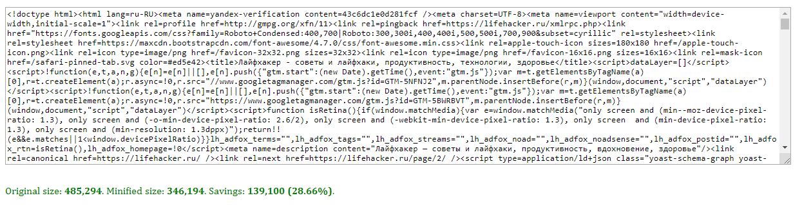

Так как половину всего контента занимают картинки, нужно оптимизировать и их.

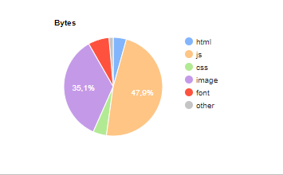

Сжав картинки без потерь можно сэкономить ещё `37KB`

**Решение:** 

Сжимать все статичные файлы, для WordPress думаю можно легко найти плагины. Для картинок можно использовать, например, [imaginary](https://github.com/h2non/imaginary), где просто передаются параметры. Будет удобно в связке с тегом `<picture>`, не придётся грузить на мобильные устройства десктопные картинки.


### Проблема №3. HTTP/1.1

На сайте подгружаются множество мелких картинок, однострочных css файлов,  например:

* https://lifehacker.ru/wp-content/themes/lifehacker/inc/classes/LhAbTitleSplitTesting/static/homepage.css
* https://lifehacker.ru/wp-content/plugins/lh-post-source/static/public/main.min.css
* https://lifehacker.ru/wp-content/plugins/lh-twister/assets/style.css
* https://lifehacker.ru/wp-content/plugins/lh-widgets/js/viewed.js

**Решение:** 

На сайте 35 JS файлов и 18 CSS. Так как сайт работает на HTTP/1.1, я считаю, правильней было бы объединять такие файлы, картинки склеивать с спрайт, небольшие svg иконки можно заинлайнить. 

### Проблема №4 Preconnect

На сайте используется множество рекламных ресурсов от разных разработчиков. Можно помочь браузеру, указав какой URL будет использоваться с помощью preconnect или dns-prefetch.

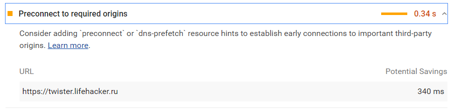

**Решение:** 

Использовать dns-prefect или preconnect для URL ресурсов.

### Проблема №5. CDN

На сайте практически не используется CDN для доставки статичных файлов. 

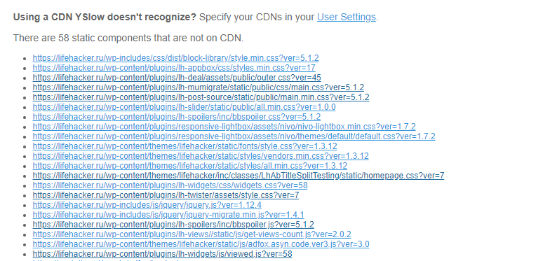

**Решение:**

Перенос статики на CDN позволит отвечать и грузиться быстрее, так как пользователь будет загружать файлы с ближайшего сервера.

### Проблема №6. Google Fonts

На сайте загружаются все возможные начертания шрифтов для разных языков, включая греческий и вьетнамский, которые вряд ли используются на сайте. Также, с недавних времен, google fonts позволяет указывать параметр для font-dispay, что позволит ускорить First Meaningful Paint.

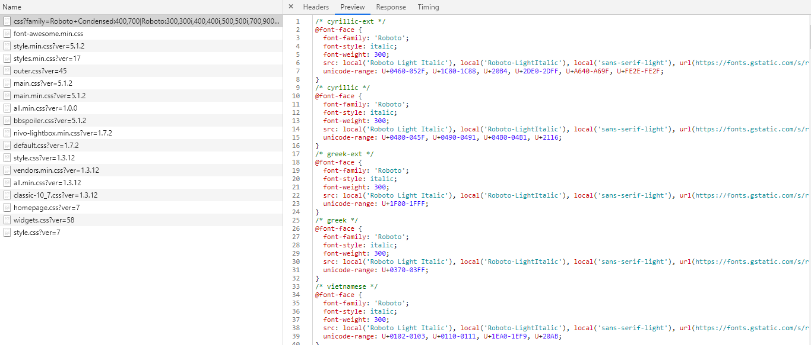

**Решение:**

Указать параметр font-display. Загружать только нужные шрифты.

## Performance

<table>
    <tr>
        <td>Событие</td>
        <td>Время в мс.</td>
    </tr>
    <tr>
        <td>First Paint</td>
        <td>1806.1</td>
    </tr>
    <tr>
        <td>First Meaningful Paint</td>
        <td>1989.5</td>
    </tr>
    <tr>
        <td>DOM Content Loaded</td>
        <td>2439.6</td>
    </tr>
    <tr>
        <td>Load</td>
        <td>4733.7</td>
    </tr>
</table>

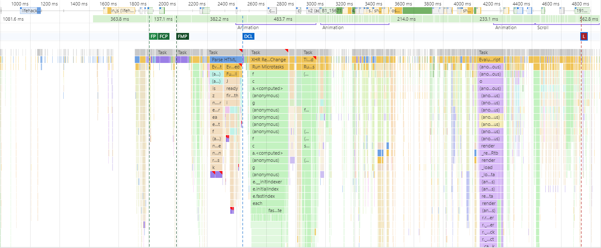

---

<table>
    <tr>
        <td>Этап обработки документа</td>
        <td>Время в мс.</td>
    </tr>
    <tr>
        <td>Loading</td>
        <td>45</td>
    </tr>
    <tr>
        <td>Scripting</td>
        <td>2428</td>
    </tr>
    <tr>
        <td>Rendering</td>
        <td>781</td>
    </tr>
    <tr>
        <td>Painting</td>
        <td>149</td>
    </tr>
</table>

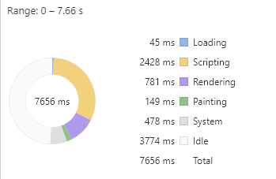

В некоторых участках встречаются тормозные места, чаще всего это изменения ширины элемента, что провоцирует в свою очередь дорогую операцию layout. Так как на странице огромное количество DOM-элементов, уровень вложенности в которых иногда достигает *24* – получаем просадку FPS.

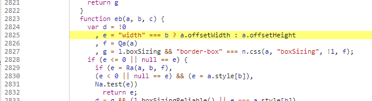
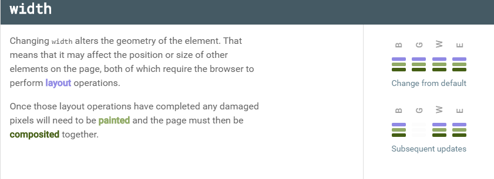

## Coverage

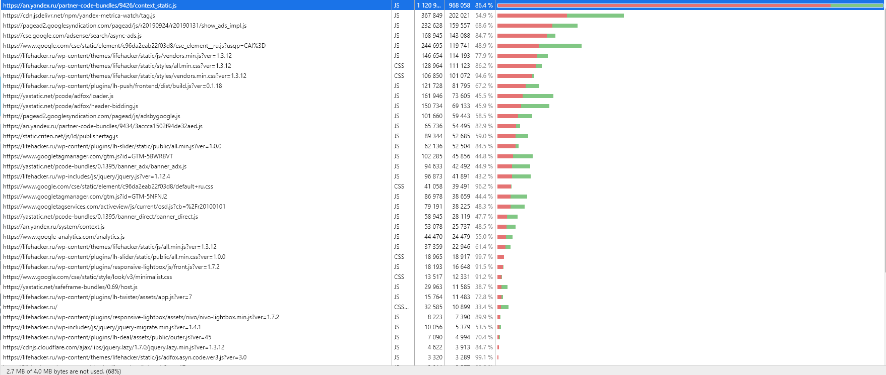

Если на различные метрики нельзя повлиять, то сократить количество неиспользованно CSS можно сократить.

<table>
    <tr>
        <td>Тип ресурса</td>
        <td>Объём неиспользованных данных в килобайтах</td>
    </tr>
    <tr>
        <td>CSS</td>
        <td>414,070</td>
    </tr>
    <tr>
        <td>JS</td>
        <td>367,290</td>
    </tr>
</table>

_Для таблицы использовались файлы, подгружаемые конкретно с lifehacker.ru. Сторонние метрики в учёт не брал. Думаю так будет правильнее._

## CPU 4x slowdown и Slow 3G

### Performance

<table>
    <tr>
        <td>Событие</td>
        <td>Время в мс.</td>
    </tr>
    <tr>
        <td>First Paint</td>
        <td>11413.4</td>
    </tr>
    <tr>
        <td>First Meaningful Paint</td>
        <td>15330.3</td>
    </tr>
    <tr>
        <td>DOM Content Loaded</td>
        <td>24859.4</td>
    </tr>
    <tr>
        <td>Load</td>
        <td>51788.8</td>
    </tr>
</table>

---

<table>
    <tr>
        <td>Этап обработки документа</td>
        <td>Время в мс.</td>
    </tr>
    <tr>
        <td>Loading</td>
        <td>233</td>
    </tr>
    <tr>
        <td>Scripting</td>
        <td>6481</td>
    </tr>
    <tr>
        <td>Rendering</td>
        <td>6667</td>
    </tr>
    <tr>
        <td>Painting</td>
        <td>1260</td>
    </tr>
</table>


